# **일변량 범주형 데이터의 탐색**
## 5-1 도수분포표의 작성 

```r
favorite <- c('WINTER', 'SUMMER', 'SPRING', 'SUMMER', 'SUMMER',
              'FALL', 'FALL', 'SUMMER', 'SPRING', 'SPRING')
favorite                                # favorite의 내용 출력
```

```
##  [1] "WINTER" "SUMMER" "SPRING" "SUMMER" "SUMMER" "FALL"   "FALL"   "SUMMER"
##  [9] "SPRING" "SPRING"
```

```r
table(favorite)                         # 도수분포표 계산
```

```
## favorite
##   FALL SPRING SUMMER WINTER 
##      2      3      4      1
```

```r
table(favorite)/length(favorite)        # 비율 출력
```

```
## favorite
##   FALL SPRING SUMMER WINTER 
##    0.2    0.3    0.4    0.1
```

## 5-2 막대그래프의 작성 

```r
ds <- table(favorite)
ds                
```

```
## favorite
##   FALL SPRING SUMMER WINTER 
##      2      3      4      1
```

```r
barplot(ds, main='favorite season')
```

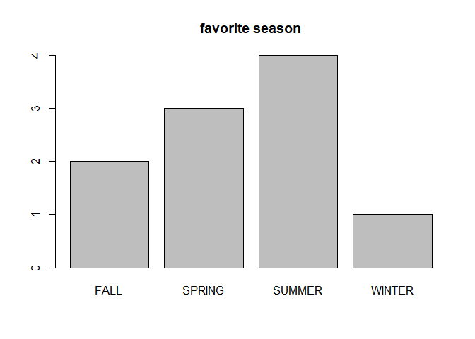<!-- -->

## 5-3 원그래프의 작성

```r
ds <- table(favorite)
ds                
```

```
## favorite
##   FALL SPRING SUMMER WINTER 
##      2      3      4      1
```

```r
pie(ds, main='favorite season')
```

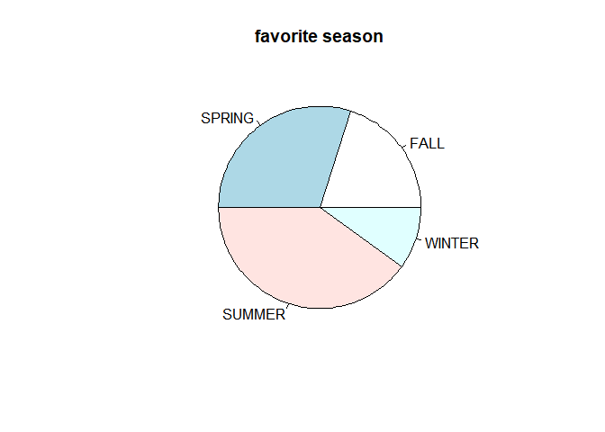<!-- -->

## 5-4 숫자로 표현된 범주형 데이터

```r
favorite.color <- c(2, 3, 2, 1, 1, 2, 2, 1, 3, 2, 1, 3, 2, 1, 2)
ds <- table(favorite.color)
ds
```

```
## favorite.color
## 1 2 3 
## 5 7 3
```

```r
barplot(ds, main='favorite color')
```

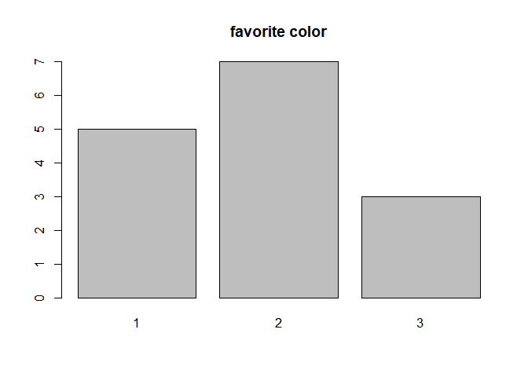<!-- -->

```r
colors <- c('green', 'red', 'blue')
names(ds) <- colors                             # 자료값 1,2,3을 green, red, blue로 변경
ds
```

```
## green   red  blue 
##     5     7     3
```

```r
barplot(ds, main='favorite color', col=colors)  # 색 지정 막대그래프
```

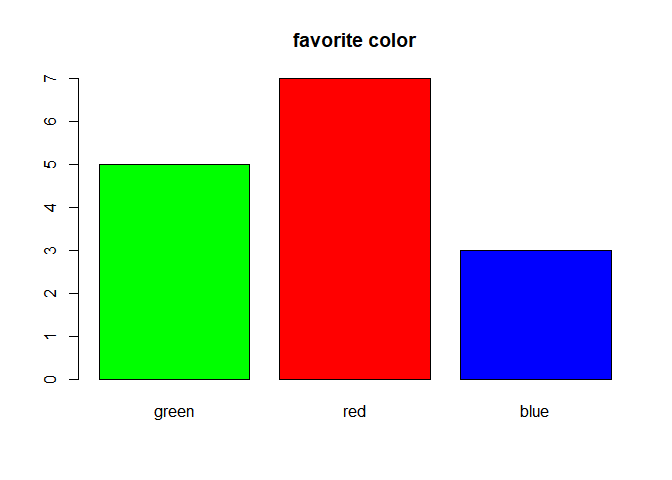<!-- -->

```r
pie(ds, main='favorite color', col=colors)      # 색 지정 원그래프
```

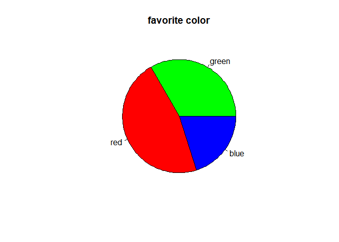<!-- -->

# **일변량 수치형 데이터의 탐색** 
## 5-5 평균과 중앙값

```r
weight <- c(60, 62, 64, 65, 68, 69)
weight.heavy <- c(weight, 120)
weight
```

```
## [1] 60 62 64 65 68 69
```

```r
weight.heavy
```

```
## [1]  60  62  64  65  68  69 120
```

```r
mean(weight)                  # 평균
```

```
## [1] 64.66667
```

```r
mean(weight.heavy)            # 평균
```

```
## [1] 72.57143
```

```r
median(weight)                # 중앙값
```

```
## [1] 64.5
```

```r
median(weight.heavy)          # 중앙값
```

```
## [1] 65
```

```r
mean(weight, trim=0.2)        # 절사평균(상하위 20% 제외)
```

```
## [1] 64.75
```

```r
mean(weight.heavy,trim=0.2)   # 절사평균(상하위 20% 제외)
```

```
## [1] 65.6
```

## 5-6 사분위수(quartile)

```r
mydata <- c(60, 62, 64, 65, 68, 69, 120)
quantile(mydata)              # default로 3개 cut points생성  4개구간(사분위수,quartile)생성 
```

```
##    0%   25%   50%   75%  100% 
##  60.0  63.0  65.0  68.5 120.0
```

```r
quantile(mydata, (0:10)/10)   # [0,1]구간 확률벡터를 인자로, 즉 10%단위로  구간 나눔  
```

```
##    0%   10%   20%   30%   40%   50%   60%   70%   80%   90%  100% 
##  60.0  61.2  62.4  63.6  64.4  65.0  66.8  68.2  68.8  89.4 120.0
```

```r
summary(mydata)
```

```
##    Min. 1st Qu.  Median    Mean 3rd Qu.    Max. 
##   60.00   63.00   65.00   72.57   68.50  120.00
```

## 5-7 분포(Distribution) : 분산, 표준편차, Range

```r
mydata <- c(60, 62, 64, 65, 68, 69, 120)
var(mydata)           # 분산
```

```
## [1] 447.2857
```

```r
sd(mydata)            # 표준편차
```

```
## [1] 21.14913
```

```r
range(mydata)         # 값의 범위
```

```
## [1]  60 120
```

```r
diff(range(mydata))   # 최댓값, 최솟값의 차이
```

```
## [1] 60
```

## 5-8 히스토그램

```r
dist <- cars[,2]                        # 자동차 제동거리
hist(dist,                              # 자료(data)
     main="Histogram for dist",         # 제목
     xlab ="dist",                      # x축 레이블 -제동거리
     ylab="count",                      # y축 레이블 -빈도수
     border="blue",                     # 막대 테두리색
     col="green",                       # 막대 색
     las=2,                             # 축의 tick label 글씨 방향(0~3)
     breaks=5)                          # 5개 break points, 6개 막대 
```

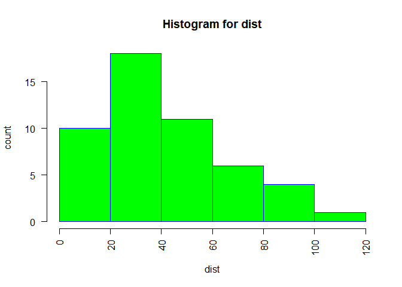<!-- -->

## 5-9 상자그림(box plot)

```r
dist <- cars[,2]                        # 자동차 제동거리(단위: 피트)
boxplot(dist, main="dist")              # 자동차 제동거리 
```

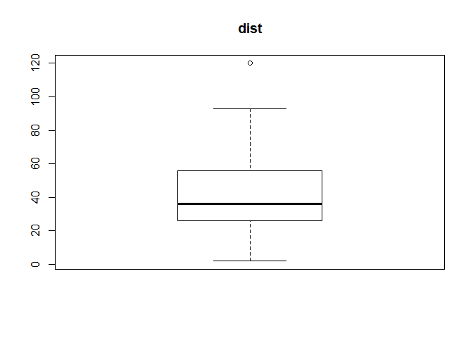<!-- -->

## 5-10 boxplot.stats()에 의한 상세 내용 확인 

```r
boxplot.stats(dist)
```

```
## $stats
## [1]  2 26 36 56 93
## 
## $n
## [1] 50
## 
## $conf
## [1] 29.29663 42.70337
## 
## $out
## [1] 120
```

## 5-11 그룹이 있는 데이터에 대한 상자그림 

```r
boxplot(Petal.Length~Species, data=iris, main="Petal.Length by Species") # 품종별 꽃잎의 길이
```

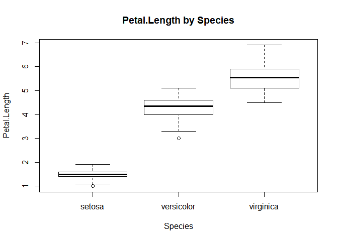<!-- -->

## 5-12 한 화면에 그래프 여러개 그리기 

```r
par(mfrow=c(1,3))
barplot(table(mtcars$carb), 
        main="Barplot of Carburetors",
        xlab="#of carburetors",  
        ylab="frequency",
        col="blue")
barplot(table(mtcars$cyl), 
        main="Barplot of Cylender",
        xlab="#of cylender",  
        ylab="frequency",
        col="red")
barplot(table(mtcars$gear), 
        main="Barplot of Grar",
        xlab="#of gears",  
        ylab="frequency",
        col="green")
```

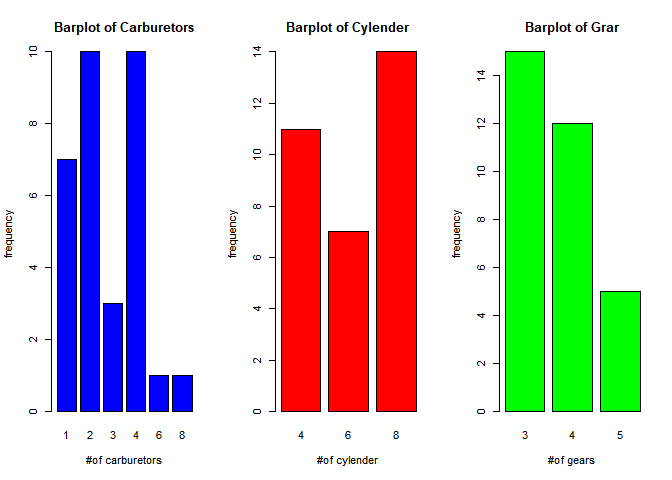<!-- -->

```r
par(mfrow=c(1,1))
```

# **다중 변수 데이터의 탐색** 
## 6-1 두 변수 사이의 산점도

```r
wt <-mtcars$wt                   # 중량 자료
mpg <- mtcars$mpg                # 연비 자료
plot(wt, mpg,                    # 2개 변수(x축, y축)     
     main="wt vs MPG",           # 제목 - 중량-연비 그래프
     xlab="wt",                  # x축 레이블- 중량(wt)
     ylab="MPG",                 # y축 레이블- 연비(MPG)
     col="red",                  # point의 color
     pch=19)                     # point의 종류 
```

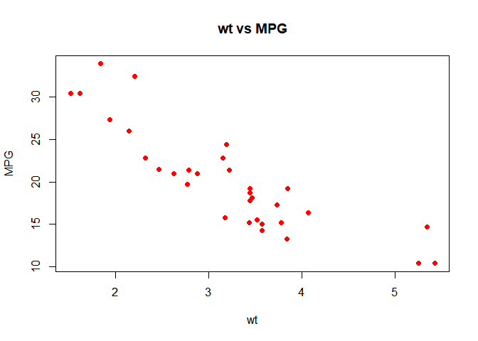<!-- -->

## 6-2 여러 변수들 간의 산점도 

```r
vars <- c("mpg","disp","drat","wt")    # 대상 변수 
target <- mtcars[,vars]
head(target)
```

<div class="kable-table">

                      mpg   disp   drat      wt
------------------  -----  -----  -----  ------
Mazda RX4            21.0    160   3.90   2.620
Mazda RX4 Wag        21.0    160   3.90   2.875
Datsun 710           22.8    108   3.85   2.320
Hornet 4 Drive       21.4    258   3.08   3.215
Hornet Sportabout    18.7    360   3.15   3.440
Valiant              18.1    225   2.76   3.460

</div>

```r
pairs(target, main="Multi Plots")     # 대상 데이터     
plot(target, main="Multi Plots")     # 위와 동일한 결과 
```

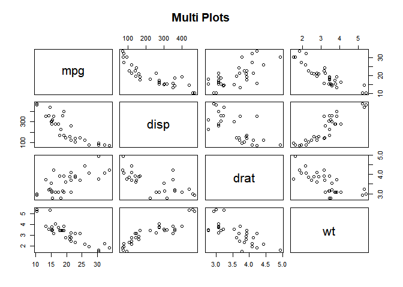<!-- -->

## 6-3 그룹 정보가 있는 두 변수의 산점도 

```r
iris.2 <- iris[,3:4]                # 데이터 준비
point <- as.numeric(iris$Species)   # 점의 모양
point                               # point 내용 출력
```

```
##   [1] 1 1 1 1 1 1 1 1 1 1 1 1 1 1 1 1 1 1 1 1 1 1 1 1 1 1 1 1 1 1 1 1 1 1 1 1 1
##  [38] 1 1 1 1 1 1 1 1 1 1 1 1 1 2 2 2 2 2 2 2 2 2 2 2 2 2 2 2 2 2 2 2 2 2 2 2 2
##  [75] 2 2 2 2 2 2 2 2 2 2 2 2 2 2 2 2 2 2 2 2 2 2 2 2 2 2 3 3 3 3 3 3 3 3 3 3 3
## [112] 3 3 3 3 3 3 3 3 3 3 3 3 3 3 3 3 3 3 3 3 3 3 3 3 3 3 3 3 3 3 3 3 3 3 3 3 3
## [149] 3 3
```

```r
color <- c("red","green","blue")    # 점의 컬러
plot(iris.2, 
     main="Iris plot",
     pch=c(point),
     col=color[point]) 
```

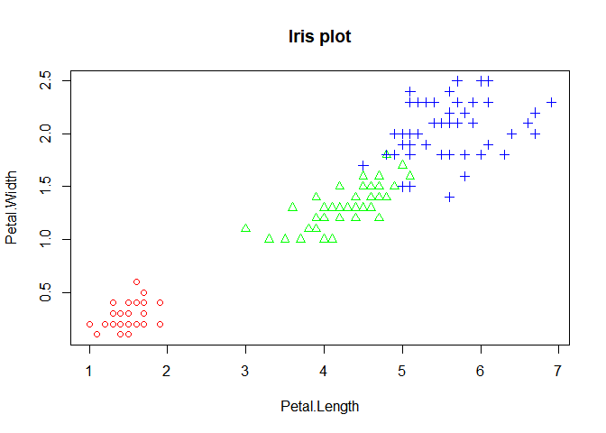<!-- -->

## 6-4 R을 이용한 상관계수의 계산 

```r
beers = c(5,2,9,8,3,7,3,5,3,5)                 # 자료 입력
bal <- c(0.1,0.03,0.19,0.12,0.04,0.0095,0.07,  # 자료 입력
         0.06,0.02,0.05)
tbl <- data.frame(beers,bal)                   # 데이터프레임 생성
tbl                                
```

<div class="kable-table">

 beers      bal
------  -------
     5   0.1000
     2   0.0300
     9   0.1900
     8   0.1200
     3   0.0400
     7   0.0095
     3   0.0700
     5   0.0600
     3   0.0200
     5   0.0500

</div>

```r
plot(bal~beers,data=tbl)                       # 산점도 
res <- lm(bal~beers,data=tbl)                  # 회귀식 도출
abline(res)                                    # 회귀선 그리기
```

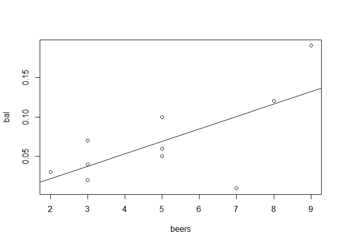<!-- -->

```r
cor(beers,bal)                                 # 상관계수 계산
```

```
## [1] 0.6797025
```

## 6-5 4개 변수간 상관성 분석

```r
cor(iris[,1:4])                   # 4개 변수 간 상관성 분석
```

```
##              Sepal.Length Sepal.Width Petal.Length Petal.Width
## Sepal.Length    1.0000000  -0.1175698    0.8717538   0.8179411
## Sepal.Width    -0.1175698   1.0000000   -0.4284401  -0.3661259
## Petal.Length    0.8717538  -0.4284401    1.0000000   0.9628654
## Petal.Width     0.8179411  -0.3661259    0.9628654   1.0000000
```

## 6-6 선그래프의 작성 

```r
month = 1:12                             # 자료 입력
late  = c(5,8,7,9,4,6,12,13,8,6,6,4)     # 자료 입력      
plot(month,                              # x data
     late,                               # y data
     main="Late cnt trend over time",    # 제목 - 지각생 통계
     type= "l",                          # 그래프의 종류 선택(알파벳) 
     lty=1,                              # 선의 종류(line type) 선택
     lwd=1,                              # 선의 굵기 선택
     xlab="Month",                       # x축 레이블
     ylab="Late cnt"                     # y축 레이블
)
```

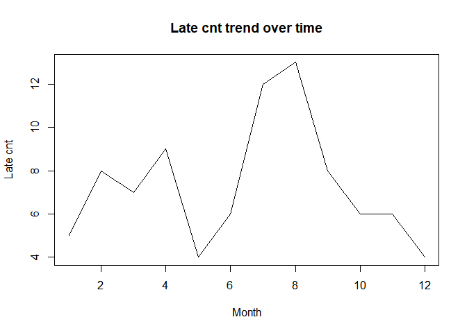<!-- -->

## 6-7 복수의 선그래프 작성 

```r
month = 1:12
late1  = c(5,8,7,9,4,6,12,13,8,6,6,4)
late2  = c(4,6,5,8,7,8,10,11,6,5,7,3)
plot(month,                                # x data
     late1,                                # y data
     main="Late Students",
     type= "b",                            # 그래프의 종류 선택(알파벳) 
     lty=1,                                # 선의 종류(line type) 선택
     col="red",                            # 선의 색깔 선택          
     xlab="Month ",                        # x축 레이블
     ylab="Late cnt",                      # y축 레이블
     ylim=c(1, 15)                         # y축 값의 (하한, 상한)
)
lines(month,                               # x data
      late2,                               # y data
      type = "b",                          # 선의 종류(line type) 선택
      col = "blue")                        # 선의 색깔 선택
```

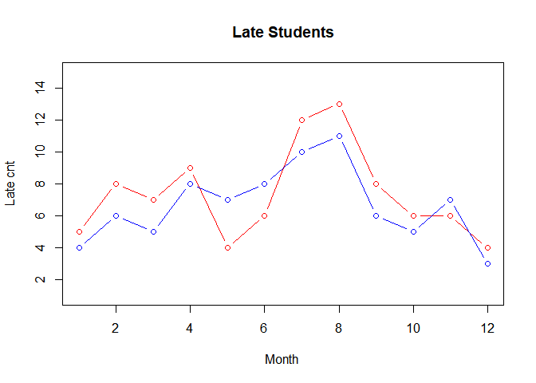<!-- -->

# **탐색적 데이터 분석 과정(6-8)** 
### (1) 분석 대상 데이터셋 준비 

```r
#install.packages("mlbench")
library(mlbench)
data("BostonHousing")
myds <- BostonHousing[,c("crim","rm","dis","tax","medv")]
```

### (2) grp 변수 추가  

```r
grp <- c()
for (i in 1:nrow(myds)) {                   # myds$medv 값에 따라 그룹 분류
  if (myds$medv[i] >= 25.0) {
    grp[i] <- "H"
  } else if (myds$medv[i] <= 17.0) {
    grp[i] <- "L"
  } else {
    grp[i] <- "M"
  }
}
grp <- factor(grp)                          # 문자벡터를 팩터 타입으로 변경
grp <- factor(grp, levels=c("H","M","L"))   # 레벨의 순서를 H,L,M -> H,M,L

myds <- data.frame(myds, grp)               # myds 에 grp 컬럼추가
```

### (3) 데이터셋의 형태와 기본적인 내용 파악  

```r
str(myds)  
```

```
## 'data.frame':	506 obs. of  6 variables:
##  $ crim: num  0.00632 0.02731 0.02729 0.03237 0.06905 ...
##  $ rm  : num  6.58 6.42 7.18 7 7.15 ...
##  $ dis : num  4.09 4.97 4.97 6.06 6.06 ...
##  $ tax : num  296 242 242 222 222 222 311 311 311 311 ...
##  $ medv: num  24 21.6 34.7 33.4 36.2 28.7 22.9 27.1 16.5 18.9 ...
##  $ grp : Factor w/ 3 levels "H","M","L": 2 2 1 1 1 1 2 1 3 2 ...
```

```r
head(myds)
```

<div class="kable-table">

    crim      rm      dis   tax   medv  grp 
--------  ------  -------  ----  -----  ----
 0.00632   6.575   4.0900   296   24.0  M   
 0.02731   6.421   4.9671   242   21.6  M   
 0.02729   7.185   4.9671   242   34.7  H   
 0.03237   6.998   6.0622   222   33.4  H   
 0.06905   7.147   6.0622   222   36.2  H   
 0.02985   6.430   6.0622   222   28.7  H   

</div>

```r
table(myds$grp)                             # 주택 가격 그룹별 분포
```

```
## 
##   H   M   L 
## 132 247 127
```

### (4) 히스토그램에 의한 관측값의 분포 확인 

```r
par(mfrow=c(2,3))                           # 2x3 가상화면 분할
for(i in 1:5) {
  hist(myds[,i], main=colnames(myds)[i], col="yellow")
}
par(mfrow=c(1,1))                           # 2x3 가상화면 분할 해제
```

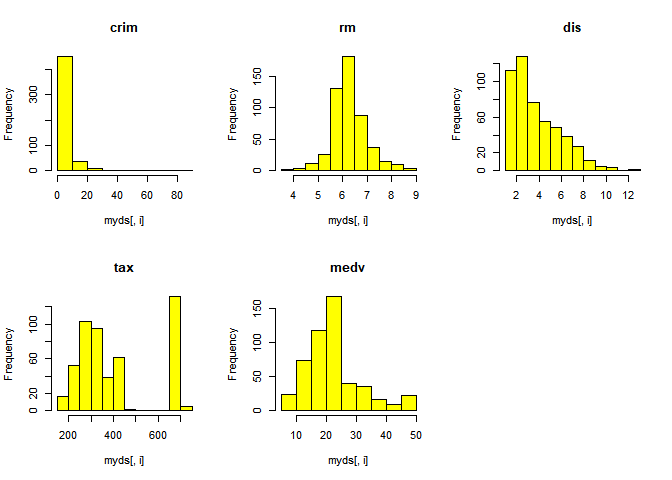<!-- -->

### (5) 상자그림에 의한 관측값의 분포 확인 

```r
par(mfrow=c(2,3))                           # 2x3 가상화면 분할
for(i in 1:5) {
  boxplot(myds[,i], main=colnames(myds)[i])
}
par(mfrow=c(1,1))                           # 2x3 가상화면 분할 해제
```

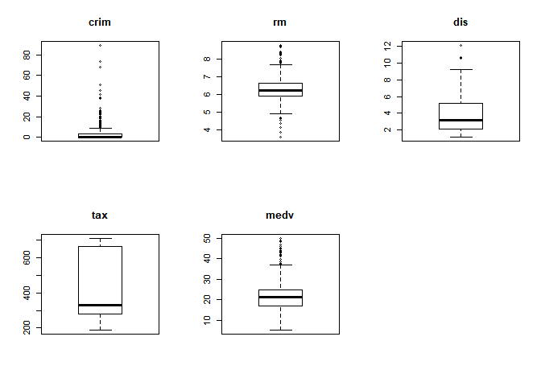<!-- -->

### (6) 그룹별 관측값 분포의 확인 

```r
boxplot(myds$crim~myds$grp, main="crim")  # 1인당 범죄율
```

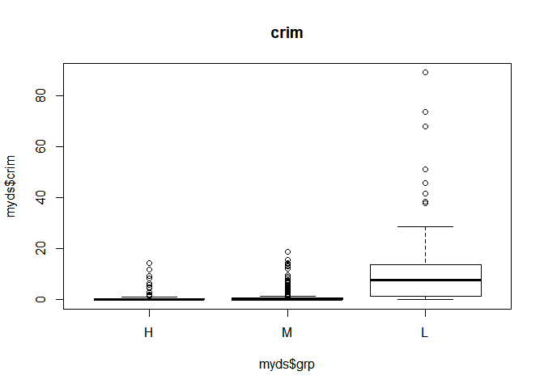<!-- -->

```r
boxplot(myds$rm~myds$grp, main="rm")      # 방의 수 
```

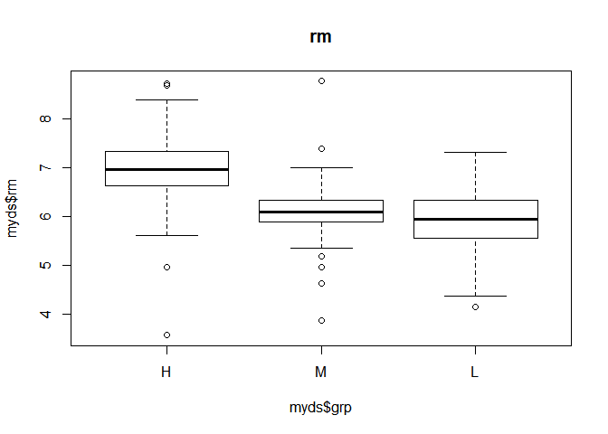<!-- -->

```r
boxplot(myds$dis~myds$grp, main="dis")    # 직업센터까지의 거리
```

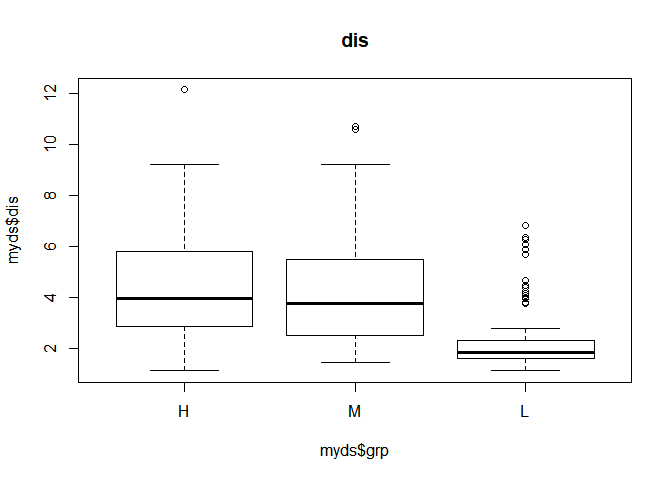<!-- -->

```r
boxplot(myds$tax~myds$grp, main="tax")    # 재산세 
```

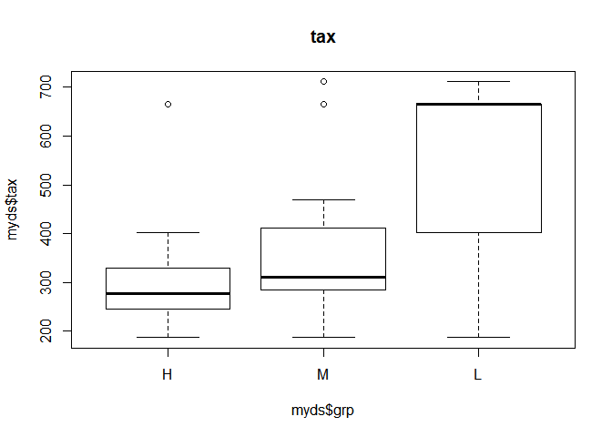<!-- -->

### (7) 다중 산점도를 통한 변수간 상관 관계의 확인 

```r
pairs(myds[,-6])
```

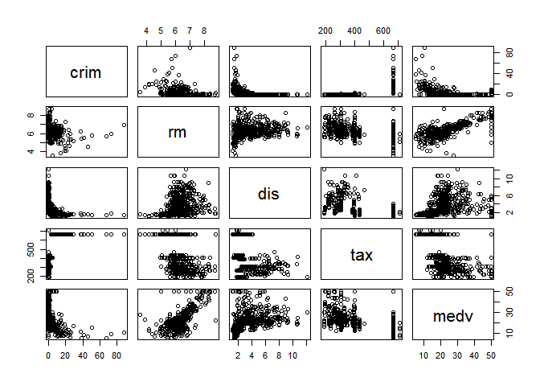<!-- -->

### (8) 그룹 정보를 포함한 변수간 상관 관계의 확인  

```r
point <- as.integer(myds$grp)                 # 점의 모양 지정
color <- c("red","green","blue")              # 점의 색 지정   
pairs(myds[,-6], pch=point, col=color[point])
```

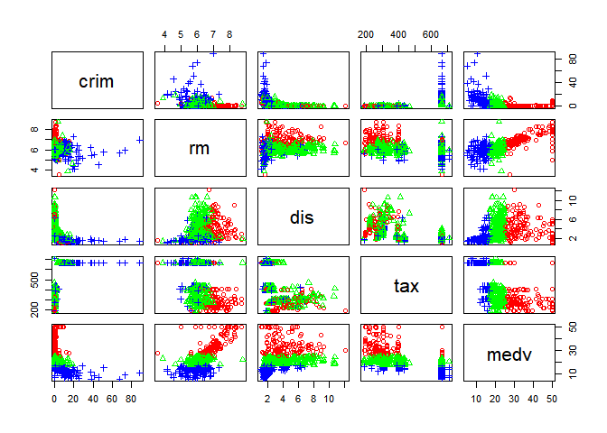<!-- -->

### (9) 변수간 상관관계(correlation coefficient)의 확인 

```r
cor(myds[,-6])
```

```
##            crim         rm        dis        tax       medv
## crim  1.0000000 -0.2192467 -0.3796701  0.5827643 -0.3883046
## rm   -0.2192467  1.0000000  0.2052462 -0.2920478  0.6953599
## dis  -0.3796701  0.2052462  1.0000000 -0.5344316  0.2499287
## tax   0.5827643 -0.2920478 -0.5344316  1.0000000 -0.4685359
## medv -0.3883046  0.6953599  0.2499287 -0.4685359  1.0000000
```
